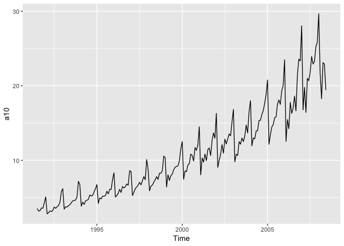
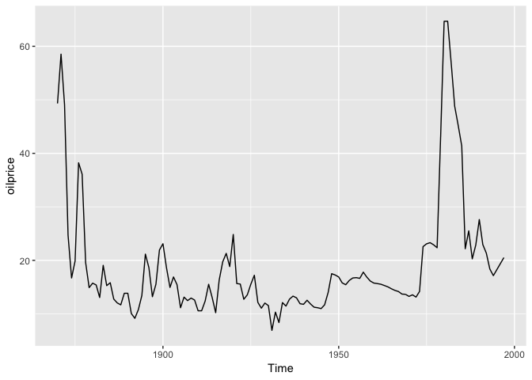
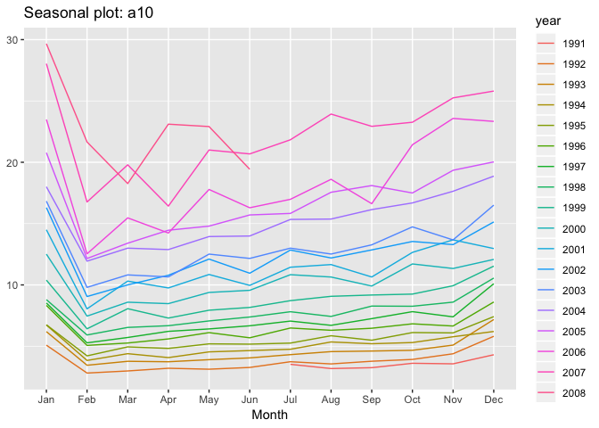
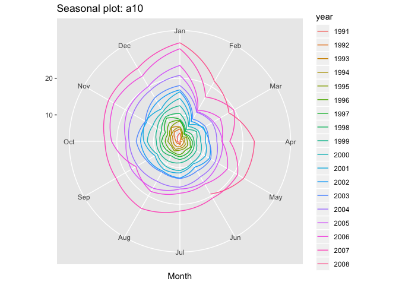
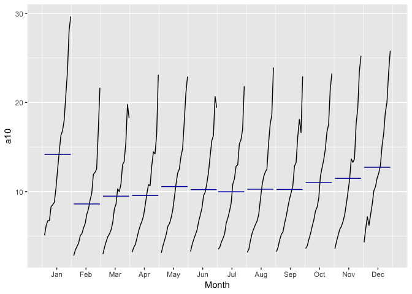
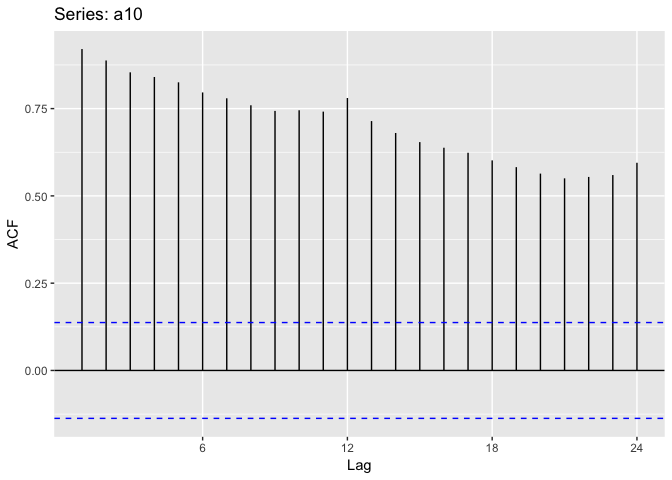
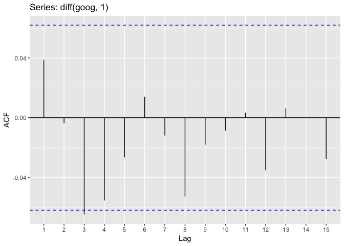
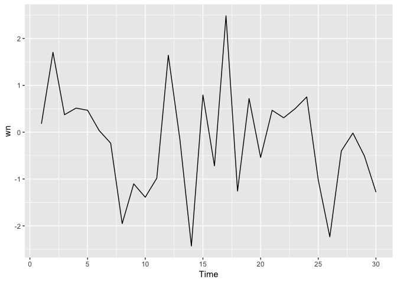
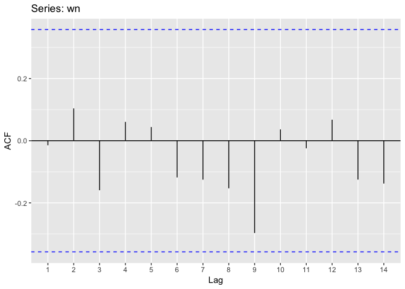

# A first look to real time series


```r
library(fpp2)
autoplot(a10)
```

<!-- -->


```r
autoplot(oilprice)
```

<!-- -->


```r
ggseasonplot(a10)
```

<!-- -->


```r
ggseasonplot(a10, polar = TRUE)
```

<!-- -->


```r
ggsubseriesplot(a10)
```

<!-- -->

# Forecasting

Forecasting is about using past information contained on a time series to predict its behavior into the future. The three most important sources of information a series can have are:

- Trends

> A pattern exists involving a long-term increase or decrease in the data.

- Seasonal

> A periodic pattern exists due to the calendar (the quarter, the day of the week, the year)

- Cyclic

> A pattern exists where the data exhibits rises and falls that are not of fixed period

## More formal

Forecasting is about using past information to predict the future. The best test to check whether to see if this is even possible, it is to check that the past does predict the future within the data that we have. That is, the information of the next week is correlated with the information of this week. 

Formally, **this is defined as autocorrelation.** Autocorrelation is defined for a specific lag:


```r
ggAcf(a10)
```

<!-- -->


```r
ggAcf(diff(goog, 1), lag.max = 15)
```

<!-- -->

The different types of information to exploit that we talked about before can be seen formally in the AutoCorrelationFunction:

- Trends induce positive correlations in the early lags

- Seasonality will induce peaks at the seasonal lags.

- Cyclicity induces peaks at the average cycle length.

# What is the standard for no information?

The White Noise! A series of i.i.d. values tossed together into a time series. Then, by definition, there is no Trend, Seasonality neither Cyclicity. Then, if a time series approximates to what we see in White Noise, then there is not that much information to use to forecast the series into the future. 
Let's check what White Noise looks like:


```r
wn <- ts(rnorm(30))
autoplot(wn)
```

<!-- -->


```r
ggAcf(wn)
```

<!-- -->

The autocorrelation lags are bounded by two horizontal blue lines. This lines represent the values when a hypothesis test would tell us to reject the hypothesis that this SINGLE lag comes from a white noise. 

To check in bulk whether a bunch of lags look like they came from a White Noise, use the Ljung-Box test:


```r
Box.test(wn, lag = 15)
```

```
## 
## 	Box-Pierce test
## 
## data:  wn
## X-squared = 7.173, df = 15, p-value = 0.9527
```

Then, there is no information to reject the null hypothesis that this comes from a White Noise. Whereas:


```r
Box.test(a10, lag = 15)
```

```
## 
## 	Box-Pierce test
## 
## data:  a10
## X-squared = 1884.5, df = 15, p-value < 2.2e-16
```

There is statistical evidence to reject the hypothesis that this data comes from a White Noise, which is evident after looking to its plot:


```r
autoplot(a10)
```

<!-- -->


```r
ggAcf(a10)
```

<!-- -->

