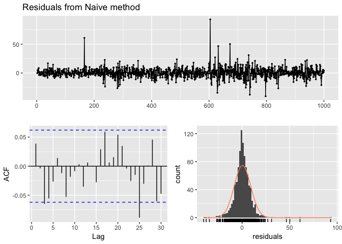
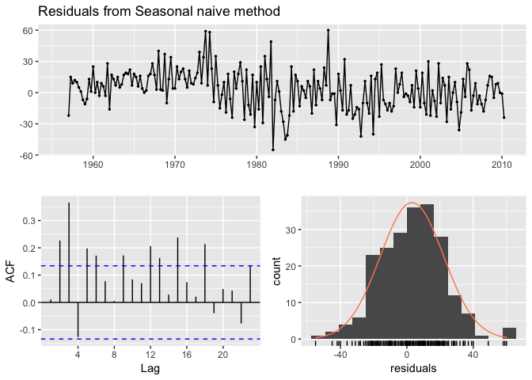
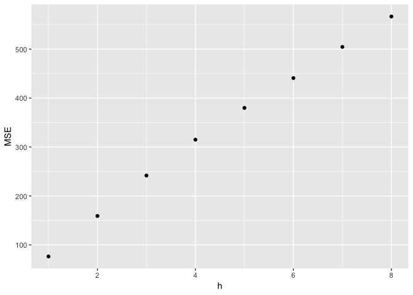

Once you have a forecast method, do the following:

1- Make sure your forecast methods **has exploited all the available information in the series in a reasonable manner**. To do so, compare the fitted values for the series and the observations, then, check the difference between them, which we call the residuals. Specially, you will want your residuals to:

- Not be autocorrelated.
- Have a zero mean.
- Have a constant variance.
- Close to normal.

The first three amount to the **residuals being White Noise**. Incorporating the fourth one results in Gaussian White Noise. 

2- Create a reasonable estimation of your forecasting error. To do so, use a training/test separation or use a Cross Validation strategy. Nota bene: use the split with the step-ahead number that is of interest to you, not just the default of one-step ahead prediction. 

# Code

## Checking residuals


```r
library(fpp2)
```

```
## Loading required package: ggplot2
```

```
## Loading required package: forecast
```

```
## Loading required package: fma
```

```
## Loading required package: expsmooth
```

```r
library(forecast)
# Check the residuals from the naive forecasts applied to the goog series
goog %>% naive() %>% checkresiduals()
```

<!-- -->

```
## 
## 	Ljung-Box test
## 
## data:  Residuals from Naive method
## Q* = 13.123, df = 10, p-value = 0.2169
## 
## Model df: 0.   Total lags used: 10
```

```r
# Do they look like white noise (TRUE or FALSE)
googwn <- TRUE

# Check the residuals from the seasonal naive forecasts applied to the ausbeer series
ausbeer %>% snaive() %>% checkresiduals
```

<!-- -->

```
## 
## 	Ljung-Box test
## 
## data:  Residuals from Seasonal naive method
## Q* = 60.535, df = 8, p-value = 3.661e-10
## 
## Model df: 0.   Total lags used: 8
```

```r
# Do they look like white noise (TRUE or FALSE)
beerwn <- FALSE
```

## Train and test splits


```r
# Create the training data as train
train <- window(gold, end = 1000)

# Compute naive forecasts and save to naive_fc
naive_fc <- naive(train, h = length(gold) - length(train))

# Compute mean forecasts and save to mean_fc
mean_fc <- meanf(train, h = 108)

# Use accuracy() to compute RMSE statistics
accuracy(naive_fc, gold)
```

```
##                     ME      RMSE       MAE         MPE     MAPE     MASE
## Training set  0.101013  6.307613  3.164141  0.01871991 0.795349 1.001822
## Test set     -6.538350 15.842361 13.638350 -1.74622688 3.428789 4.318139
##                    ACF1 Theil's U
## Training set -0.3108473        NA
## Test set      0.9793153  5.335899
```

```r
accuracy(mean_fc, gold)
```

```
##                         ME     RMSE      MAE       MPE      MAPE      MASE
## Training set -4.239671e-15 59.17809 53.63397 -2.390227 14.230224 16.981449
## Test set      1.319363e+01 19.55255 15.66875  3.138577  3.783133  4.960998
##                   ACF1 Theil's U
## Training set 0.9907254        NA
## Test set     0.9793153  6.123788
```

```r
# Assign one of the two forecasts as bestforecasts
bestforecasts <- naive_fc
```


Here, you will use the Melbourne quarterly visitor numbers (vn[, "Melbourne"]) to create three different training sets, omitting the last 1, 2 and 3 years, respectively. 


## Cross Validation

Here, you will use `tsCV()` to compute and plot the MSE values for up to 8 steps ahead, along with the `naive()` method applied to the goog data.


```r
# Compute cross-validated errors for up to 8 steps ahead
e <- as.matrix(tsCV(goog, forecastfunction = naive, h = 8))

# Compute the MSE values and remove missing values
mse <- colMeans(e^2, na.rm = TRUE)

# Plot the MSE values against the forecast horizon
data.frame(h = 1:8, MSE = mse) %>%
  ggplot(aes(x = h, y = MSE)) + geom_point()
```

<!-- -->

As we try to forecast ahead, our forecast error incrases. 

## Good Forecast Model

Where possible, try to find a model that has low RMSE on a test set and has white noise residuals


