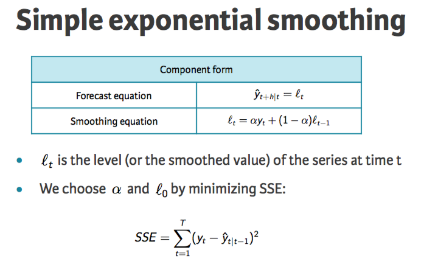
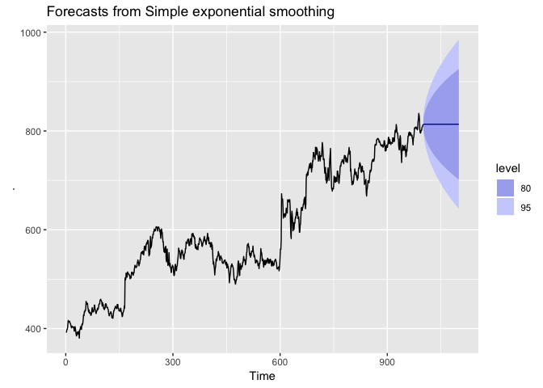

# Improving on the mean

One of the simplest and quickest way to forecast is just to use the mean of the whole time series:


```r
library(fpp2)
```

```
## Loading required package: ggplot2
```

```
## Loading required package: forecast
```

```
## Loading required package: fma
```

```
## Loading required package: expsmooth
```

```r
library(forecast)

goog %>% 
  forecast::meanf(h = 100) %>% 
  autoplot()
```

<!-- -->

However, as evident above, that is not good enough: earlier observations should count less towards our prediction than later observations. That is exactly what **Exponential Smoothing is all about**.

# Exponential Smoothing

Forecasts produced using exponential smoothing methods are weighted averages of past observations, with the weights decaying exponentially as the observations get older. In other words, the more recent the observation, the higher the associated weight. This framework generates reliable forecasts quickly and for a wide range of time series, which is a great advantage and of major importance to applications in business.

## Simple Exponential Smoothing

This is a straightforward improvent on the mean: where observations are weighted according to their temporal distance to the observation that we are predicting.


Which can also be seen as simply adjusting a previous level taking into account a new observation




```r
goog %>% 
  ses(h = 100) %>% 
  autoplot()
```

<!-- -->

## Improving: take into accound trend

What if the series we are predicting has a trend. Then our level prediction must take into account this. We do it as we did before: propose a starting level, and sequentially improving according to a new parameter.


