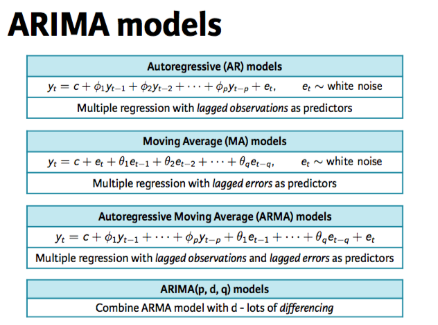
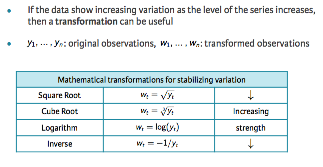

# Explaining variation beyond the mean

Just as in basic econometrics the step beyond calculating means is regressions, so it is in the time series. If before we explained a mean with exponential smoothing, we will now run a regression on the lags and residual lags to explain the present. Thus, the former coefficients are going to be personalized for each lag. 



However, this depends on the other observations means' and variances' being as relevant to the present as they are to their closest temporal neighboors. In mathematical terms, this means that the series must be stationary: constant mean, constant autocorrelation, and constant variance across time. 

Note that most series we've seen do not hold these conditions. Constant mean means no trend and constant variance mean that any seasonality or cyclicality stays constant thorough time. 

## Fixing the trend

To detrend a series, most often we concentrate on predicting the changes between observations and not the observations themselves. That is, we study the differences in differences instead of just differences. More often than not, this will result on an untrended series. 

To detrend the series from a specific seasonal factor, we must create seasonal differences. That is, if each year at december a big spike happens, then do a 12-lag difference. 

The combination of a lag-1 detrending and a seasonal detrending will result in a series with no trend. Each difference is called an Integration. 

```{r}
library(fpp2)
library(forecast)

wmurders %>% autoplot()
```

And fix the trend:

```{r}
wmurders %>% diff(1) %>% autoplot()
```

Sometimes you need to apply both seasonal differences and lag-1 differences to the same series, thus, calculating the differences in the differences.

```{r}
# Plot the data
autoplot(h02)

# Take logs and seasonal differences of h02
difflogh02 <- diff(log(h02), lag = 12)

# Plot difflogh02
autoplot(difflogh02)

# Take another difference and plot
ddifflogh02 <- diff(difflogh02, 1)
autoplot(ddifflogh02)

# Plot ACF of ddifflogh02
ggAcf(ddifflogh02)
```


## Fixing the seasonality/cyclicality variance

We can apply transformations to the whole series to make sure that the variance stays constant thorought time. 



To automate this process, we can use the Box-Cox transformation:


```{r}
# Plot the series
autoplot(a10)

a10 %>% BoxCox(BoxCox.lambda(a10)) %>% autoplot()
```

# Auto Arima

There are lots of possible combinations for ARIMAS. However, there is an algorithm to make the model selection data-based: try lots of them and choose the best performer in an information criterion. 


```{r}
# Fit an automatic ARIMA model to the austa series
fit <- auto.arima(austa)

# Check that the residuals look like white noise
checkresiduals(fit)
residualsok <- TRUE

# Summarize the model
summary(fit)

# Find the AICc value and the number of differences used
AICc <- -14.46
d <- 1

# Plot forecasts of fit
fit %>% forecast(h = 10) %>% autoplot()
```

However, it must be noted that information criteria only work for models from the same class. Thus, we cannot use them to compare **ETS versus ARIMA**. To compare them, we must resort to use training/test sets.

```{r}
# Set up forecast functions for ETS and ARIMA models
fets <- function(x, h) {
  forecast(ets(x), h = h)
}
farima <- function(x, h) {
  forecast(auto.arima(x), h = h)
}

# Compute CV errors for ETS as e1
e1 <- tsCV(austa, fets, 1)

# Compute CV errors for ARIMA as e2
e2 <- tsCV(austa, farima, 1)

# Find MSE of each model class
mean(e1^2, na.rm = TRUE)
mean(e2^2, na.rm = TRUE)

# Plot 10-year forecasts using the best model class
austa %>% farima(h = 10) %>%
autoplot()
```

When we need to apply a BoxCox transformation, auto.arima can also take care of that. And of taking it back to plot in the original scale. 

```{r}
# Check that the logged h02 data have stable variance
h02 %>% log() %>% autoplot()

# Fit a seasonal ARIMA model to h02 with lambda = 0
fit <- auto.arima(h02, lambda = BoxCox.lambda(h02))

# Summarize the fitted model
summary(fit)

# Record the amount of lag-1 differencing and seasonal differencing used
d <- 1
D <- 1

# Plot 2-year forecasts
fit %>% forecast(h = 24) %>% autoplot()
```

For seasonal

```{r}
# Use 20 years of the qcement data beginning in 1988
train <- window(qcement, start = 1988, end = c(2007, 4))

# Fit an ARIMA and an ETS model to the training data
fit1 <- auto.arima(train)
fit2 <- ets(train)

# Check that both models have white noise residuals
checkresiduals(fit1)
checkresiduals(fit2)

# Produce forecasts for each model
fc1 <- forecast(fit1, h = 25)
fc2 <- forecast(fit2, h = 25)

# Use accuracy() to find better model based on RMSE
accuracy(fc1, qcement)
accuracy(fc2, qcement)
bettermodel <- fc2

bettermodel %>% autoplot()
```


