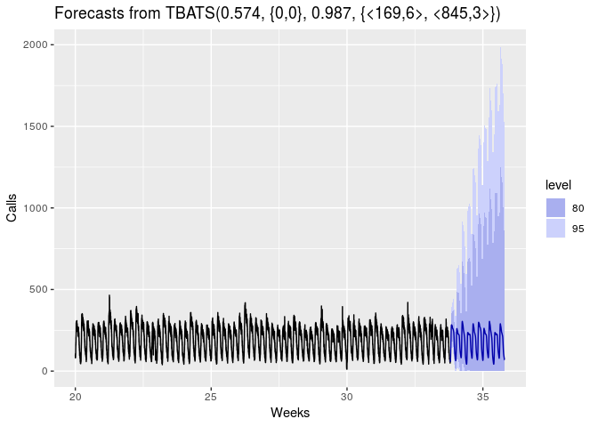

```r
library(fpp2)
```

```
## Loading required package: ggplot2
```

```
## Loading required package: forecast
```

```
## Loading required package: fma
```

```
## Loading required package: expsmooth
```

```r
library(forecast)
```


# What Advanced Models?

- Dynamic Regressions. 

- Dynamic Harmonic Regression: Handling Advanced Seasonality with Fourier Series. 

- TBATS: Automating everything!

## Dynamic Regression

Quite simply, a normal regression BUT with an ARIMA process used as the error term:


$$ y = \beta_0 + x_1\beta_1 + \epsilon $$


Note that the dependent variables can be any other time series to use. However, note that to predict your time series into the future you will have to predict these explanatory time series as well.


```r
auto.arima(uschange[,"Consumption"],
                    xreg = uschange[,"Income"]) %>% 
    forecast(xreg = rep(0.8, 8)) %>% # Provide regressors
    autoplot()
```

<!-- -->

## Dynamic Harmonic Regression: Handling Advanced Seasonality with Fourier Series

Periodic seasonality can be handled using pairs of Fourier terms. Add this terms as you would any other regressor, and use an ARIMA process for the errors:


```r
 fit <- auto.arima(a10, xreg = fourier(a10, K = 1),
                    seasonal = FALSE, lambda = 0) # k = pairs of trig
fit %>% forecast(xreg = fourier(a10, K = 1, h = 24)) %>%
     autoplot() 
```

<!-- -->


```r
 fit <- auto.arima(a10, xreg = fourier(a10, K = 3),
                    seasonal = FALSE, lambda = 0) # k = pairs of trig
fit %>% forecast(xreg = fourier(a10, K = 3, h = 24)) %>%
     autoplot() 
```

<!-- -->

The # pairs of trigs functions to use is then an hyperparamet to set.

**Nota bene: Fourier series are extraordinarily helpful when trying to deal with complex seasonality patterns like the ones you may find with daily or subdailty data: weekly patterns, daily patterns and hourly patterns**

## TBATS models

- Trigonometric terms for seasonality.

- Box-Cox transformations for hetereogeneity.

- ARMA errors for short-term dynamics.

- Trend (possibly damped).

- Seasonal (including multiple and non-integer periods)

> uses a combination of Fourier terms with an exponential smoothing state space model and a Box-Cox transformation, in a completely automated manner.
>


```r
calls %>% head()
```

```
## Multi-Seasonal Time Series:
## Start: 1 1
## Seasonal Periods: 169 845
## Data:
## [1] 111 113  76  82  91  87
```

**Nota bene: Multi Seasonal Time Series. See `msts` package**


```r
calls %>% window(start = 20) %>%
    tbats() %>% forecast() %>%
    autoplot() + xlab("Weeks") + ylab("Calls")
```

<!-- -->

! So wide :(
